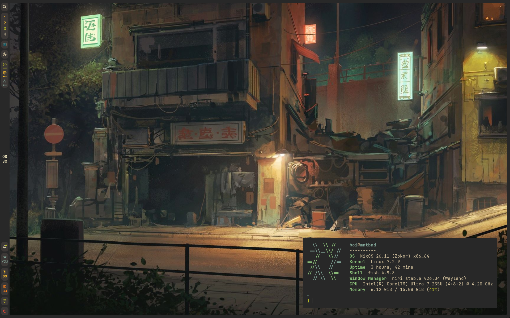

<div align="center">



# nixdots

**A flake-based NixOS + Home Manager setup for one laptop, built around niri and Gruvbox.**

<br />

[](https://nixos.org)
[](https://github.com/YaLTeR/niri)
[](https://github.com/nix-community/home-manager)
[](https://github.com/morhetz/gruvbox)
<br />
[](.github/workflows/lint.yml)
[](https://github.com/Yasir-Zafar/nixdots/commits/main)
[](https://github.com/Yasir-Zafar/nixdots)

[Overview](#overview) · [Layout](#layout) · [Install](#install) · [nx](#nx) · [Greeters](#greeters) · [Credits](#credits)

</div>

---

## Overview

| | |
| --- | --- |
| **OS** | NixOS `nixos-unstable`, latest kernel, systemd-boot |
| **Compositor** | [niri](https://github.com/YaLTeR/niri) (scrollable tiling, Wayland) |
| **Shell / bar** | [Noctalia](https://github.com/noctalia-dev/noctalia) |
| **Greeter** | [sysc-greet](https://github.com/Nomadcxx/sysc-greet) on greetd, Gruvbox + ASCII rain |
| **Terminal** | Ghostty, zellij, atuin, lazygit, fastfetch |
| **Shells** | zsh (login), fish, bash |
| **Editor** | Neovim via [nixvim](https://github.com/nix-community/nixvim) (kickstart-style, nightly), plus VS Code and JetBrains |
| **Theming** | [Stylix](https://github.com/nix-community/stylix) with `gruvbox-dark-medium`, opt-in per target |
| **Fonts** | JetBrainsMono Nerd Font, Inter, Source Serif Pro |
| **GTK / icons / cursor** | Gruvbox-Green-Dark, Gruvbox-Plus-Dark, Bibata Modern Classic |
| **Browser** | [Zen](https://github.com/0xc000022070/zen-browser-flake) |
| **Gaming** | Steam (+ [Millennium](https://github.com/SteamClientHomebrew/Millennium)), Heroic, Prism Launcher, Dolphin, gamemode |
| **Discord** | Vencord via [nixcord](https://github.com/FlameFlag/nixcord) |
| **Hardware** | HP OmniBook 5 16", Intel Core Ultra 7 255U, Intel graphics |

## Layout

The system and the user environment are **two independent flakes**, so a broken home config never blocks a system rebuild and the other way round.

```text
dots/
├── nix/                  NixOS flake  ->  nixosConfigurations.mntbnd
│   ├── flake.nix
│   ├── configuration.nix  imports every module below
│   ├── boot/              systemd-boot, kernel params
│   ├── hardware/          generated config, Intel graphics, swap, firmware
│   ├── desktop/           niri, sysc-greet, fonts (+ alternate greeters)
│   ├── services/          audio, bluetooth, networking, power, syncthing
│   ├── gaming/            steam, gamemode, launchers, emulators
│   ├── development/       system-level toolchains
│   ├── security/
│   └── users/
├── hm/                   Home Manager flake  ->  homeConfigurations.boi
│   ├── flake.nix
│   ├── home.nix
│   ├── desktop/           niri config, noctalia, stylix, gtk/qt, nixcord
│   ├── terminal/          ghostty, shells + aliases, tools, nx
│   ├── development/       editors, languages, git
│   └── applications/      media, documents, network, utilities
├── dotfiles/nixvim/      Neovim, written in Nix
├── assets/               wallpaper, avatar, GTK and icon themes
└── statix.toml           lint ignores
```

Every directory has a `default.nix` that only imports its siblings. To turn something off, comment out one import line.

## Install

> [!WARNING]
> This is a personal config. It hardcodes the user `boi`, the host `mntbnd` and this laptop's `hardware-configuration.nix`. Read it and borrow pieces rather than applying it blind.

```sh
# 1. clone to ~/dots (nx expects that path; override with NX_DOTS)
git clone https://github.com/Yasir-Zafar/nixdots ~/dots
cd ~/dots

# 2. swap in your own hardware config
nixos-generate-config --show-hardware-config > nix/hardware/hardware-configuration.nix

# 3. build the system, then the home
sudo nixos-rebuild switch --flake ./nix#mntbnd
nix run home-manager -- switch --flake ./hm#boi
```

After the first switch, everything goes through `nx`.

## nx

`nx` is one command for the whole update lifecycle. It lives in [`hm/terminal/nx.nix`](hm/terminal/nx.nix), wraps [`nh`](https://github.com/nix-community/nh), and ships zsh and fish completions.

| Command | What it does |
| --- | --- |
| `nx update [input…]` | update both `flake.lock`s, all inputs or only the ones named |
| `nx os [switch\|boot\|test\|build]` | rebuild the system |
| `nx home [switch\|build] [-b]` | rebuild the home, `-b` backs up conflicting files |
| `nx all` | update, then switch system, then switch home |
| `nx build` | build both without activating anything |
| `nx diff` | package changes since boot (`nvd`) |
| `nx status` | lock ages, nixpkgs revisions, git state, disk |
| `nx doctor` | checks env vars, stray flakes, failed units, core dumps, `.bak` files, pending reboot, nixpkgs drift between the two flakes |
| `nx rollback [os\|home] [N]` | list generations or go back |
| `nx clean` / `nx optimise` | garbage-collect (keep 7 days / 5 gens) and dedupe the store |
| `nx storage [report\|clean]` | show what's eating disk and clear only caches that rebuild themselves |
| `nx firmware [check\|update\|…]` | firmware updates through fwupd / LVFS |
| `nx try <greeter>` | boot-test another greeter (see below) |
| `nx lint` / `nx fmt` | statix + deadnix, and alejandra |

## Greeters

Every greeter has its own problems, so the alternatives stay in the repo next to the active one:

| Variant | File |
| --- | --- |
| **sysc-greet** (active) | [`nix/desktop/default.nix`](nix/desktop/default.nix) |
| tuigreet | [`default-tuigreet.nix`](nix/desktop/default-tuigreet.nix) |
| LightDM | [`default-ldm.nix`](nix/desktop/default-ldm.nix) |
| GDM | [`default-g.nix`](nix/desktop/default-g.nix) |
| ly | [`default-l.nix`](nix/desktop/default-l.nix) |

`nx try ldm` swaps the import, builds, and with your OK makes that variant the default boot entry. It restores `configuration.nix` afterwards and never touches the running session. Go back with `nx os boot`.

## Development

```sh
nix develop ./nix   # alejandra, statix, deadnix, nh
nx fmt && nx lint
```

CI runs the same statix, deadnix and alejandra checks on every push and pull request.

## Credits

- [niri](https://github.com/YaLTeR/niri) and [niri-flake](https://github.com/epireyn/niri-flake) (epireyn's fork of sodiboo's)
- [Noctalia](https://github.com/noctalia-dev/noctalia)
- [sysc-greet](https://github.com/Nomadcxx/sysc-greet)
- [Stylix](https://github.com/nix-community/stylix), [nixvim](https://github.com/nix-community/nixvim), [nixcord](https://github.com/FlameFlag/nixcord), [nh](https://github.com/nix-community/nh)
- [Gruvbox Plus icons](https://github.com/SylEleuth/gruvbox-plus-icon-pack) and [Gruvbox GTK theme](https://github.com/Fausto-Korpsvart/Gruvbox-GTK-Theme)

<div align="center">
<br />
<sub>made with ❄️ and too many rebuilds</sub>
</div>
